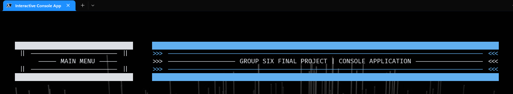
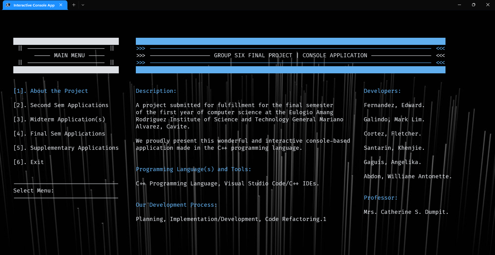
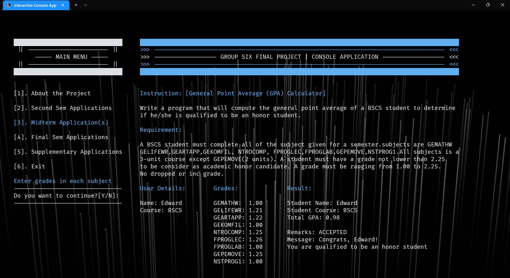
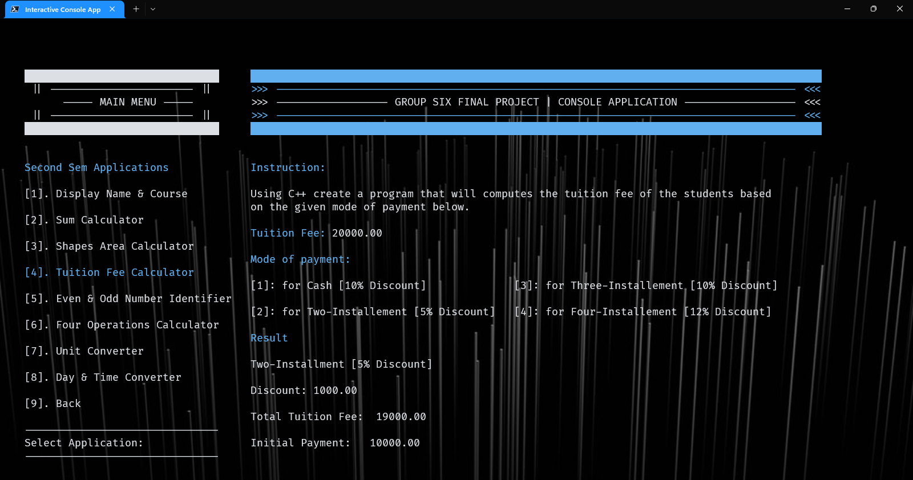

<!-- ## Members

- [Edward Fernandez](https://www.facebook.com/wardvisual)
- [Mark Lim Estela Galindo](https://www.facebook.com/marklimestella.galindo)
- [Khenjie Santarin](https://www.facebook.com/keeeeeenn665)
- [Flecher Cortez](https://www.facebook.com/chechemr.pogi)
- [Angelika Gaguis](https://www.facebook.com/ghel.gaguis)
- [Williane Antonette Abdon](https://www.facebook.com/willianneantonette.abdon.9) -->

<!-- PROJECT LOGO -->
 

  

  <h3 align="center">Interactive Console Application</h3>
  
School Project

  

  An application that integrates various school laboratory activities from the second to the final semester. This project aims to produce an interactive console-based application. 
     
     
    <a href="https://github.com/wardvisual/interactive-console-app"><strong>View Project »</strong></a>
     
     
    <a href="https://github.com/wardvisual/interactive-console-app">View Demo</a>
    ·
    <a href="https://github.com/wardvisual/interactive-console-app/issues">Report Bug</a>
    ·
    <a href="https://github.com/wardvisual/interactive-console-app/issues">Request Feature</a>
  

<!-- TECH -->

### Built With

Technologies and Tools that this project used.

- [CPlusPlus](https://docs.microsoft.com/en-us/cpp/?view=msvc-170)
- [VSCode](https://code.visualstudio.com/)

<!-- SCREENSHOTS -->

### Project Screenshot

 

<!-- CONTACT -->

## Contact

Edward Fernandez - [@wardvisual](https://twitter.com/wardvisual)
Project Link: [Interactive-Console-App](https://github.com/wardvisual/interactive-console-app)

(<a href="#top">back to top</a>)

